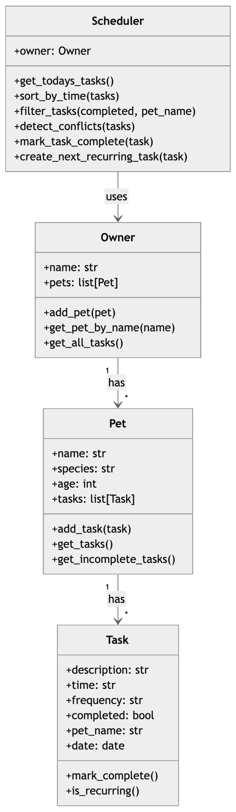

# PawPal+ (Module 2 Project)

PawPal+ is a Streamlit app that helps a pet owner manage pet care tasks and generate a daily schedule.

## Scenario

A busy pet owner needs help staying consistent with pet care. This system helps track and organize tasks such as walks, feeding, medication, grooming, and appointments.

## Features

- Add pets and tasks
- Generate a daily schedule
- Sort tasks by time
- Filter tasks by pet and completion status
- Detect scheduling conflicts
- Support recurring daily and weekly tasks

## System Design



## Files

- `app.py` - Streamlit user interface
- `pawpal_system.py` - backend classes and scheduling logic
- `main.py` - CLI demo script
- `tests/test_pawpal.py` - automated test suite
- `reflection.md` - project reflection

## Getting Started

### Setup

```bash
python -m venv .venv
source .venv/bin/activate
pip install -r requirements.txt